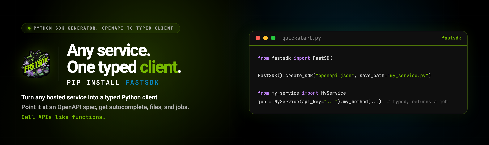

<p align="center">
  
</p>

<p align="center">
  <a href="https://pypi.org/project/fastsdk/"></a>
  <a href="https://pypi.org/project/fastsdk/"></a>
  <a href="https://github.com/SocAIty/fastSDK"></a>
  <a href="LICENSE"></a>
</p>
<h3 align="center" style="margin-top:-10px">Call any AI / web service like a native Python function</h3>

fastSDK turns any hosted service (OpenAPI/FastAPI, [APIPod](https://github.com/SocAIty/APIPod), [RunPod](https://www.runpod.io), [Replicate](https://replicate.com), [Cog](https://github.com/replicate/cog)) into a Python client: `connect`, `submit_job`, file upload/download, job handling and parallel execution.

Point it at a service. Call it like a function. That's the whole idea.

```python
import fastsdk

client = fastsdk.connect("http://localhost:8009")
job = client.submit_job("/text2voice", text="hello world")
audio = job.get_result()
audio.save("hello.mp3")
```

## Why fastSDK?

Calling a web service from Python sounds trivial until you actually do it in production:
you wait synchronously on long-running ML jobs, you hand-write request code for every endpoint, you fight with file uploads (try sending a 1 GB video through `requests`), you poll job status loops, and you reinvent threading to run requests in parallel.

fastSDK solves exactly that, and nothing else:

- **One call = one job.** Every call returns a job object immediately. Get the result when you need it, run hundreds of jobs in parallel meanwhile.
- **Files just work.** Images, audio, video are handled by [media-toolkit](https://github.com/SocAIty/media-toolkit) — local paths, URLs, bytes or numpy arrays in; media objects out. Large files are uploaded via cloud storage (S3, Azure) when configured.
- **Job-based providers are normalized.** Replicate, RunPod serverless, APIPod and Socaity all expose "submit, then poll" APIs with different wire formats. fastSDK handles submission, polling, progress and cancellation uniformly.
- **One client class.** `connect()` loads the spec and returns a `FastClient`. Call any endpoint with `submit_job(path, **params)`.

## Installation

```bash
pip install fastsdk           # core
pip install fastsdk[replicate]  # + Replicate model support
```

## Get started

`connect()` loads a URL, an `openapi.json` path, or a Replicate model reference. No files written.

```python
import fastsdk

client = fastsdk.connect("http://localhost:8009")
job = client.submit_job("/text2voice", text="hello world")
result = job.get_result()
```

### Replicate models

Official models (called via `/v1/models/{owner}/{name}/predictions`) and community models (called via `/v1/predictions` with a version) resolve automatically. Name the model:

```python
import fastsdk  # requires: pip install fastsdk[replicate] and REPLICATE_API_KEY

client = fastsdk.connect("replicate:black-forest-labs/flux-schnell")
job = client.submit_job("/predictions", prompt="a t-rex on a skateboard")
image = job.get_result()
```

### Working with jobs

```python
job = client.submit_job("/swap-img-to-img", source_img="face1.jpg", target_img="face2.jpg")
job.get_result()          # block until done and return the result
job.cancel()              # cancel locally and remotely (provider permitting)

jobs = [client.submit_job("/text2voice", text=t) for t in hundred_texts]
results = fastsdk.gather_results(jobs)
```

### API keys

Pass `api_key=...` to `connect()` or the client constructor, or set `REPLICATE_API_KEY`, `RUNPOD_API_KEY`, `SOCAITY_API_KEY`, or `<SERVICE_ID>_API_KEY`.

## The three concepts

| Concept | What it is |
|---|---|
| **Service** | An `Service` (from socaity-schemas) with one `ServiceDetails` binding: provider, execution, address, and the parsed `ServiceContract`. Get one with `fastsdk.inspect_service(source)`. |
| **Registry** | An in-process directory of services, shared by all clients. `register_service()` adds to it. |
| **Client** | `FastClient`. `connect()` returns one. Call `submit_job(path, **params)`. |

## CLI

```bash
fastsdk inspect http://localhost:8009
fastsdk call http://localhost:8009 /text2voice --text "hello world" -o hello.mp3
fastsdk registry add http://localhost:8009 --name speechcraft
fastsdk registry list
fastsdk call speechcraft /text2voice --text "hi again"
```

## Service compatibility

Works out of the box with:
- [APIPod](https://github.com/SocAIty/APIPod) services (job-based, the natural counterpart to fastSDK)
- [Replicate](https://replicate.com) models (official and community)
- [RunPod serverless](https://www.runpod.io/serverless-gpu) endpoints
- [Cog](https://github.com/replicate/cog) services
- Any OpenAPI 3.0 service ([FastAPI](https://github.com/tiangolo/fastapi), [Flask](https://flask.palletsprojects.com/), ...)
- [Socaity.ai](https://www.socaity.ai) services

## fastSDK + APIPod


[APIPod](https://github.com/SocAIty/APIPod) builds and deploys the services; fastSDK consumes them. Two beating hearts :two_hearts: for service ↔ client interaction.


## Contribute

We at SocAIty want to provide the best tools to bring generative AI to the cloud.
Report bugs, ideas and feature requests in the issues section.
fastSDK is MIT-licensed and free to use. Leave a star to support us!

---
<p align="center">
  Made with ❤️ by <a href="https://www.socaity.ai?utm_source=github&utm_content=fastsdk-20-29-06-2026">SocAIty</a>
</p>
